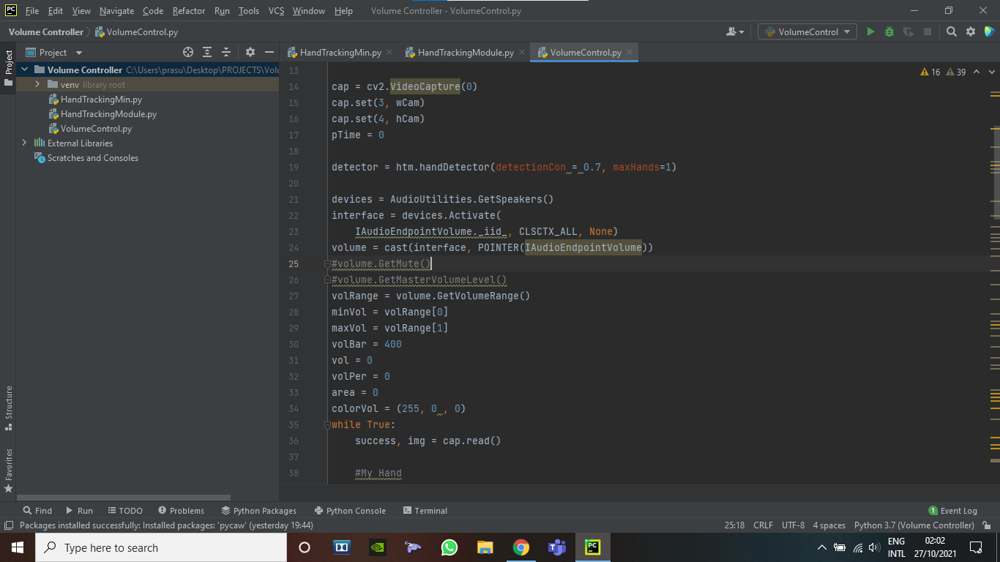

# Volume Controller (OpenCV)


## Software

##### PyCharm


## Packages 

##### 1) Mediapipe
##### 2) OpenCV
##### 3) pyclaw
##### 4) numpy


  
## Features

- Hand Tracker & Detector
- Laptop/PC Volume Controller using Finger Distance
- Colour Change on Set Volume
- Improved Callibration
## To Run The Project

```bash
  Import the Volume-Controller Folder into Pycharm.
```
```bash
  Install all the Required Packages via the Python Interpreter Settings in PyCharm
```
```bash
  Open HandTrackingModule.py and check if camera is opening via OpenCv
```
```bash
  If not then try editing the code this way:
    index = 0
    arr = []
    while True:
        cap = cv2.VideoCapture(index)
        if not cap.read()[0]:
            break
        else:
            arr.append(index)
        cap.release()
        index += 1
    return arr

    This will list out all the Webcam indexes.
```
```bash
  If HandTrackingModule.py works fine. Move on to VolumeControl.py
```
```bash
  Run the VolumeControl.py and check if you are able to change the volume using Thumb and Index Finger
```
```bash
  If not try changing the "area" parameters given in the code to suite your Webcam needs

  And You Are Done!!
```

## Demo


## Screenshot


